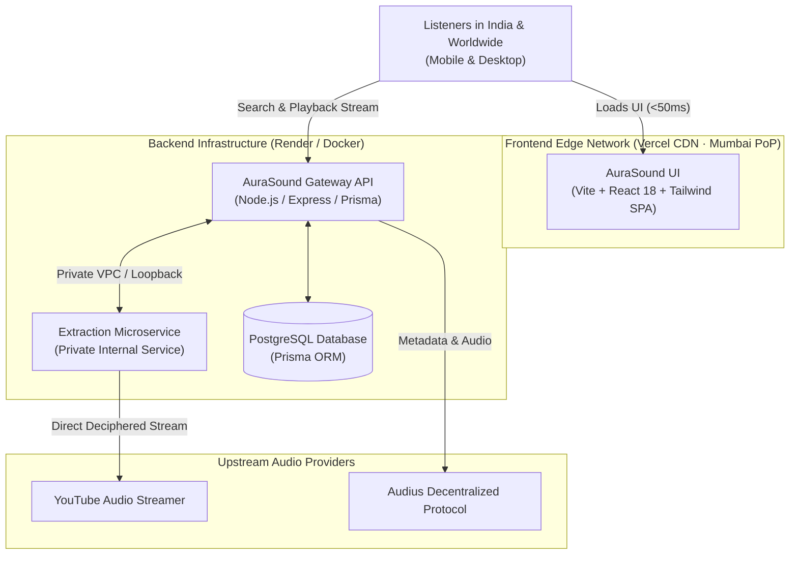

<div align="center">

# 🌌 AuraSound
### *visionOS Spatial Glass Audio Workstation & Streaming Platform*

[](https://react.dev/)
[](https://www.typescriptlang.org/)
[](https://vitejs.dev/)
[](https://tailwindcss.com/)
[](https://nodejs.org/)
[](https://expressjs.com/)
[](https://www.prisma.io/)
[](https://www.postgresql.org/)
[](https://opensource.org/licenses/MIT)

<p align="center">
  <b>A commercial-grade, open-source music streaming platform designed with Apple Vision Pro (visionOS) spatial glass aesthetics and curated for the Indian music landscape.</b>
</p>

[Explore Features](#-key-features) • [Architecture](#-production-architecture) • [Quickstart](#-quickstart-in-3-minutes) • [1-Click Deploy](#-deployment-guide)

---

</div>

## ✨ Highlights

- **🪟 visionOS Spatial Glass Aesthetics:** Floating detached capsule player bar, specular light reflections, fluid frosted glass surfaces, and dynamic ambient lighting matching the current album art.
- **🇮🇳 Curated Indian Music Catalog:** Native editorial curation for Bollywood, Punjabi Pop, Desi Hip-Hop (DHH), South Cinema (Tamil, Telugu, Malayalam), Indian Classical & Fusion, and Sufi/Ghazals.
- **⚡ Dual-Source Stream Aggregation:** Seamlessly plays and searches across **YouTube Audio** and **Audius Decentralized Network** via high-speed backend gateway with smart stream caching.
- **🎚️ Sound Lab (DSP Processing Matrix):** Built-in Web Audio API parametric EQ (Studio Reference, Bass Boost, Vocal Clarity, Spatial Immersion) and real-time frequency visualizer.
- **👥 Friends Listening Bar:** Synchronized live social listening activity across Indian cities (Mumbai, Bengaluru, Delhi, Kolkata, Hyderabad).
- **🛡️ Bulletproof Error Handling:** Resilient stream resolution with automatic skip on unavailable tracks, preventing stuck players.

---

## 🏗️ Production Architecture

AuraSound is architected as an edge-optimized Single Page Application (SPA) backed by a private microservices cluster:



---

## 📁 Repository Structure

```
aurasound/
├── src/                    # Frontend (React 18, Vite, Tailwind CSS, Zustand)
│   ├── components/         # visionOS Glass UI, PlayerBar, Sound Lab, Search, Library
│   ├── services/           # Web Audio API Engine & Gateway Client
│   ├── store/              # Zustand state store with persistent playback
│   └── data/               # Curated Indian music catalog & default vibes
├── backend/                # API Gateway (Express, Prisma, PostgreSQL)
│   ├── src/controllers/    # Tracks, search, stream resolution, favorites, queue
│   ├── src/services/       # YouTube and Audius integration services
│   └── prisma/             # Database schema (PostgreSQL)
├── extraction/             # YouTube Audio Extraction Microservice (Private)
│   └── src/                # Audio deciphering, stream extraction & validation
├── render.yaml             # 1-Click Render Blueprint (DB + Extractor + Gateway)
└── vercel.json             # Edge SPA routing & caching configuration for Vercel
```

---

## 🚀 Quickstart in 3 Minutes

### Prerequisites
- Node.js >= 18.0.0
- npm >= 9.0.0

### 1. Clone the repository
```bash
git clone https://github.com/darkpanther5667/aurasound.git
cd aurasound
```

### 2. Start the YouTube Extraction Microservice
```bash
cd extraction
npm install
npm run build
npm start
# 🔒 Extraction service running on http://127.0.0.1:4001
```

### 3. Start the Backend API Gateway
Open a second terminal:
```bash
cd backend
npm install
npx prisma db push
npm run build
npm start
# ⚡ AuraSound Gateway listening on http://localhost:4000
```

### 4. Start the Frontend Application
Open a third terminal:
```bash
npm install
npm run dev
# 🚀 Web App ready at http://localhost:5173
```

---

## 🌐 Deployment Guide

### Option 1: Render + Vercel (Recommended)

#### Part 1: Deploy Backend Stack on Render
1. Fork or push this repository to your GitHub account.
2. Go to [Render Dashboard](https://dashboard.render.com) → **New +** → **Blueprint**.
3. Select your repository. Render automatically reads [`render.yaml`](file:///home/supportgrahbook/Music%20app/render.yaml) to provision:
   - **`aurasound-db`**: Managed PostgreSQL in Singapore (optimal low-latency to India).
   - **`aurasound-extraction`**: Private internal worker service.
   - **`aurasound-backend`**: Public API Gateway with auto-wired database connection.
4. Click **Apply**. Once live, copy your backend URL:
   `https://aurasound-backend.onrender.com`

#### Part 2: Deploy Frontend on Vercel
1. Go to [Vercel Dashboard](https://vercel.com/new).
2. Import this repository.
3. In **Environment Variables**, add:
   ```env
   VITE_BACKEND_URL=https://aurasound-backend.onrender.com
   ```
4. Click **Deploy**. Vercel will build and distribute the app across global edge CDNs.

---

## ⚙️ Environment Variables Reference

### Frontend (`.env`)
| Variable | Description | Default |
| :--- | :--- | :--- |
| `VITE_BACKEND_URL` | Base URL of the AuraSound Gateway | `http://127.0.0.1:4000` |

### Backend Gateway (`backend/.env`)
| Variable | Description | Default |
| :--- | :--- | :--- |
| `PORT` | Port for the backend API | `4000` |
| `DATABASE_URL` | PostgreSQL connection string | Required |
| `EXTRACTION_SERVICE_URL` | Address of internal extraction microservice | `http://127.0.0.1:4001` |
| `CORS_ORIGIN` | Comma-separated allowed frontend origins | `*` |
| `JWT_SECRET` | Secret token for user auth sessions | Required |

### Extraction Service (`extraction/.env`)
| Variable | Description | Default |
| :--- | :--- | :--- |
| `PORT` | Port for extraction worker | `4001` |
| `HOST` | Network bind interface | `0.0.0.0` |

---

## 🎛️ Sound Lab DSP Features

AuraSound features a native client-side Web Audio DSP graph:

- **Biquad Filters:** 5-band parametric equalizer covering Sub (60Hz), Bass (250Hz), Mid (1kHz), Presence (4kHz), and Air (12kHz).
- **Preset Curves:** Studio Flat, Bass Matrix, Vocal Radiance, Spatial Expander.
- **Stereo Spatializer:** Dynamic stereo pan and subtle binaural expansion.
- **Audio Visualizer:** 60fps real-time FFT spectrum visualizer.

---

## 🤝 Contributing

Contributions are welcome! Please follow these steps:

1. Fork the Project
2. Create your Feature Branch (`git checkout -b feature/AmazingFeature`)
3. Commit your Changes (`git commit -m 'feat: add amazing feature'`)
4. Push to the Branch (`git push origin feature/AmazingFeature`)
5. Open a Pull Request

---

## 📄 License

Distributed under the **MIT License**. See `LICENSE` for more information.

---

<div align="center">
  <b>Built with ❤️ for Indian music listeners and audiophiles worldwide.</b>
</div>
