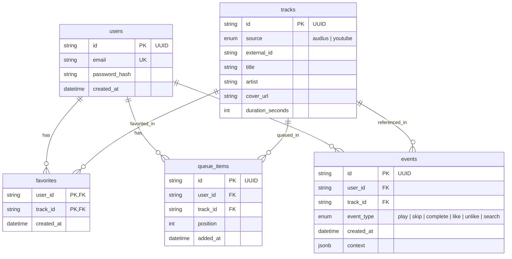

# AuraSound Backend Gateway

The central API gateway and telemetry service for the **AuraSound Music Platform**. Engineered with **Node.js, Express, TypeScript, and Prisma ORM** backed by **PostgreSQL**.

Built with a unified, cross-platform JSON contract designed to serve the Web Client and future native mobile apps (Android Media3 / iOS).

---

## 1. Tech Stack
* **Language & Runtime:** TypeScript (Node.js >= 20.x)
* **Web Framework:** Express 4.x
* **Database & ORM:** PostgreSQL 16 + Prisma ORM (with migrations)
* **Authentication:** Stateless JWT (`jsonwebtoken`) with `bcryptjs` password hashing
* **Validation:** Zod schema validation
* **Security & Traffic:** Helmet headers, CORS policy, `express-rate-limit`
* **External Integration:** Decentralized Audius Discovery Provider REST API

---

## 2. Directory Structure

```text
backend/
├── docker-compose.yml           # PostgreSQL 16 container definition
├── package.json                 # Node dependencies and build scripts
├── tsconfig.json                # TypeScript configuration
├── .env.example                 # Environment variables template
├── prisma/
│   └── schema.prisma            # PostgreSQL schema models & enums
└── src/
    ├── index.ts                 # Express entry point, middleware, route mount
    ├── lib/
    │   └── prisma.ts            # PrismaClient singleton
    ├── middleware/
    │   ├── auth.ts              # JWT verification (requireAuth & optionalAuth)
    │   └── rateLimiter.ts       # Rate limiters for API and Auth endpoints
    ├── services/
    │   └── audius.service.ts    # Audius gateway with host failover & stream resolution
    ├── controllers/
    │   ├── auth.controller.ts   # Signup and login logic
    │   ├── tracks.controller.ts # Trending & Search with Audius proxying & DB cache
    │   ├── events.controller.ts # Telemetry logging (play, skip, like, search)
    │   ├── favorites.controller.ts # User favorites management
    │   └── queue.controller.ts  # Atomic user queue management
    ├── routes/
    │   ├── auth.routes.ts       # /auth/signup, /auth/login
    │   ├── tracks.routes.ts     # /tracks/trending, /tracks/search
    │   ├── events.routes.ts     # /events
    │   ├── favorites.routes.ts  # /favorites
    │   └── queue.routes.ts      # /queue
    └── types/
        └── index.ts             # Standardized API response types
```

---

## 3. Database Schema Overview (PostgreSQL)



---

## 4. API Endpoints Reference

All endpoints return a predictable cross-platform JSON response envelope:
```json
{
  "success": true,
  "data": { ... },
  "message": "Optional feedback"
}
```

### Authentication
* `POST /auth/signup` — Registers a new user.
  * **Body:** `{ "email": "user@domain.com", "password": "securepassword" }`
  * **Response:** `{ "success": true, "data": { "user": { "id", "email" }, "token": "JWT..." } }`
* `POST /auth/login` — Authenticates user credentials.
  * **Body:** `{ "email": "user@domain.com", "password": "securepassword" }`
  * **Response:** `{ "success": true, "data": { "user": { "id", "email" }, "token": "JWT..." } }`

### Tracks & Catalog
* `GET /tracks/trending?limit=20` — Fetches top trending tracks (proxied to Audius, cached in Postgres).
* `GET /tracks/search?q=overmono&limit=20` — Queries local database and Audius search endpoint.

### Telemetry & Analytics
* `POST /events` *(Protected: Bearer Token)* — Logs user playback and search events.
  * **Body:**
    ```json
    {
      "trackId": "uuid-here",
      "eventType": "play",
      "context": { "playbackPosition": 42.5, "device": "Android", "volume": 0.8 }
    }
    ```

### Favorites
* `GET /favorites` *(Protected)* — Retrieves user's favorited tracks.
* `POST /favorites` *(Protected)* — Adds track to user favorites.
  * **Body:** `{ "trackId": "uuid-here" }` or external metadata `{ "externalId": "...", "source": "audius", "title": "..." }`.
* `DELETE /favorites/:trackId` *(Protected)* — Removes track from favorites.

### Queue Management
* `GET /queue` *(Protected)* — Returns user's active queue ordered by position.
* `PUT /queue` *(Protected)* — Atomically updates user's queue order.
  * **Body:** `{ "trackIds": ["track-uuid-1", "track-uuid-2", ...] }`

---

## 5. Local Setup & Running Instructions

### Prerequisites
* **Node.js** >= 20.x and **npm**
* **PostgreSQL** 16 (or Docker)

### Step 1: Install Dependencies
```bash
cd backend
npm install
```

### Step 2: Start PostgreSQL Database
Using Docker Compose:
```bash
docker compose up -d
```
*Or ensure your local PostgreSQL server is running and configure `DATABASE_URL` in `.env`.*

### Step 3: Run Database Migrations
Generate Prisma Client and push schema to PostgreSQL:
```bash
npx prisma generate
npx prisma db push
```

### Step 4: Run the Development Server
```bash
npm run dev
```
The server will boot on `http://localhost:4000`.

### Step 5: Verify Health
```bash
curl http://localhost:4000/health
```
Expected output:
```json
{
  "success": true,
  "data": {
    "status": "healthy",
    "service": "AuraSound Gateway API",
    "version": "1.0.0",
    "uptimeSeconds": 1
  }
}
```
